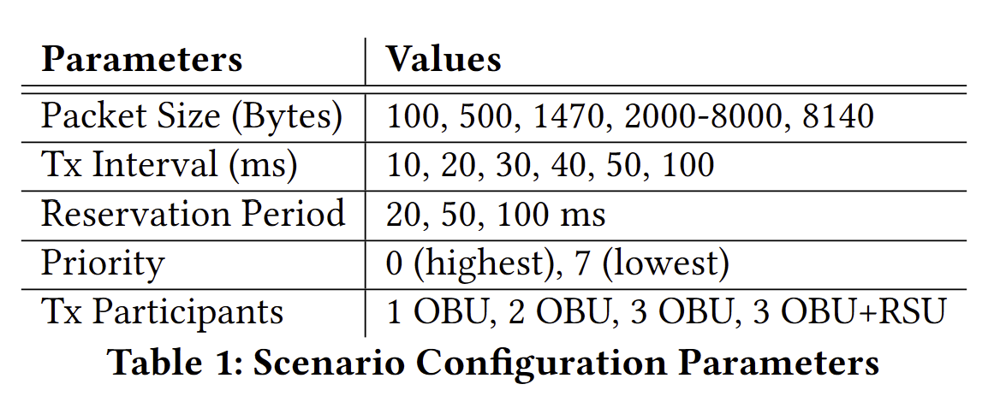

# SEE-V2X Dataset

This is the official repository of SenSys'25 paper. "SEE-V2X: A Cross-Layer Dataset for Sidelink V2X Communication".

Supoorted by "Anonymous lab".

## Get Access to the Dataset
Please check here [Dataset](https://morrishohoho.github.io/projects/seev2x/) to get access to the dataset.

## Dataset Overview
SEE-V2X is a cross-layer dataset, which includes the application layer network traces generated by the C-V2X radio, C-V2X MAC layer trace and Sidelink control information captured by USRP B210. 

The dataset includes 4 scenarios in total:
- Indoor allcombos
  - Include all the possible comniations of parameters as shown in the figure below. The data collection period for each test is around 30 seconds.

  
- Indoor special
  - We pick certain representative configurations and extend the data collection duration to 1 hour. The selected configurations are shown in the table below.

| Cases      | Description                                                                                                                                        |
|------------|----------------------------------------------------------------------------------------------------------------------------------------------------|
| Scenarios  | The configuration is the same as the outdoor scenarios                                                                                             |
| Throughput | 4 TX are transmitting in priority 0, reservation 20 ms and the packet length if from 100-8000 bytes.                                               |
| IPG        | 4 TX are transmitting in priority 0, resevation 20ms, packet length 4000 bytes and  the packet generation interval is set from 10, 20, 50, 100 ms. |
| Priority   | 4 TX are transmitting in reservation 20 ms, packet length 4000 byts, packet generation interval is set to 20 ms and the priority is set from 0-7.  |

- Outdoor parkinglot
  - We pick 10 presentative cases and collect data in a parking lot. This scneario doesn't have GNSS coordinations.

- Outdoor intersection
  - We picko 10 presentative cases and collect data in a busy intersection. This test has GNSS coordinations gotten from a high-end IMU, xsens.

## Dataset Detail
### Structure
The dataset is organized in the following structure:
```bash
.
├── indoor_allcombos
│   └── 1_tx
│   └── 2_tx
│   └── 3_tx
│   └── 4_tx
├── indoor_special 
│   ├── ipg
│   ├── priority
│   ├── scenarios
│   └── throughput
├── outdoor_openroad
│   ├── GNSS
│   ├── intersection_1
│   ├── intersection_10
│   ├── intersection_2
│   ├── intersection_3
│   ├── intersection_4
│   ├── intersection_5
│   ├── intersection_6
│   ├── intersection_7
│   ├── intersection_8
│   ├── intersection_9
│   ├── ontheway_1
│   ├── ontheway_2
│   └── parameters.csv
└── outdoor_parkinglot
    ├── 1_tx
    └── 2_tx
```
The logs in different scenarios are stored in the corresponding folders. The logs are stored in CSV format. All scenarios include the following files:
- tx_[UE].csv
- rx_[UE1]\_tx\_[UE2]\_[Application].csv
- mac.csv
- sci.csv

For the outdoor intersection scenario, the GNSS data is also included and stored in the GNSS folder. The GNSS coordinates are collected by a high-end IMU, xsens and the sampling rate is 100 Hz.

Besides, there will a parameters.csv file in the outdoor scenarios, which includes the parameters used in each test.

### tx_[UE].csv
This file is the application layer trace of the transmitter, which is generated by the C-V2X radio. The log includes the following fields:
- equipment_id: The identity of the transmitter.
- seq_num: The transmitting packet sequence number.
- priority: The transmitting packet priority, which affects the C-V2X radio transmitting behavior.
- timestamp: The transmitting packet timestamp.
- channel_busy_percentage: The channel busy percentage reported by the C-V2X radio.

### rx_[UE1]\_tx\_[UE2]\_[Application].csv
This is the end-to-end, receiver side application layer trace. The log is generated by UE1 and includes the E2E performance of UE2->UE1.
- rx_timestamp (us): The timestamp when the packet is received.
- latency (ms): Latency = rx_timestamp - tx_timestamp
- per_ue_loss_pct (%): The packet loss rate for different UEs.
- ipg (ms): The inner packet gap (jitter).
- tx_equipment_id: The identity of the transmitter.
- tx_seq_num: The sequence number of the transmitter.
- tx_priority: The transmitted packet priority.

### mac.csv
This is the C-V2X MAC layer trace captured by the USRP B210. 
MAC layer handles the radio resource management, scheduling, and the data link layer functions.
In C-V2X, there are additional source layer-2 IDs and destination layer-2 IDs in the MAC layer header to identify the transmitter and receiver.

### sci.csv
This is the sidelink control information captured by the USRP B210. SCI is an important information used in C-V2X to schedule the sidelink resources automatically between the UEs. The data in SCI.csv includes - timestamp: The timestamp in us when the USRP captures the SCI packet over the air.
- priority:
- resource_resv:
- freq_resourece:
- time_gap:
- mcs_idx:
- pscch_start:
- nof_prb:
- N_x_id:

For more details about each field in SCI, please refer to the 3GPP TS 36.212.

## Example usage
In the scripts folder, we provide some basic utils to compute network metrics and visualize the data (e.g., channel utilization, packet loss rate, etc.).
For example, to visulize the channel utilization.

Run ```my script````. The example output is shown below.
The window is interacive, you can drag or zoom in/out. 

## Citation
If you use this dataset, please cite our paper.
```
TBD
```
