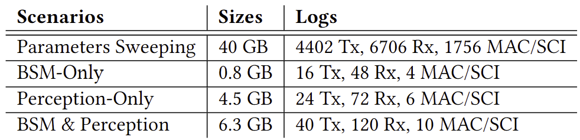
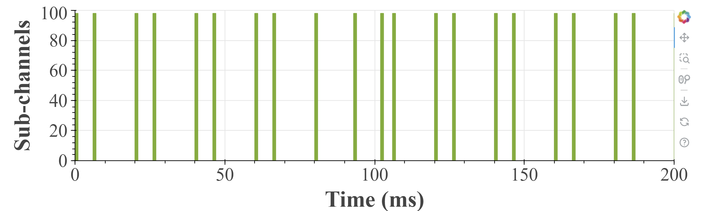

# SEE-V2X Dataset

This is the official repository of SenSys'25 paper. "SEE-V2X: A Cross-Layer Dataset for Sidelink V2X Communication".

Project website:[SEE-V2X Website](https://cisl.ucr.edu/SEE-V2X-Dataset/) Supoorted by CISL@UCR and GeNeLa@UCR.

## Get Access to the Dataset
Please check here: [Dataset](https://drive.google.com/drive/folders/1gAFsjYsjOiEH-U50wPoFzfS9-YYh_UwL?usp=sharing) to get access to the dataset.

## Dataset Overview
SEE-V2X is a cross-layer dataset, which includes the application layer network traces generated by the C-V2X radio, C-V2X MAC layer traces and Sidelink Control Information (SCI) captured by USRP B210. 

The dataset includes two scenarios: Parameters Sweeping and Emulating Applications, with the latter further divided into three sub-scenarios: BSM-only, Perception-only and BSM&Perception as shown in the figure below. 


For more details about why and how we setup these scenarios, please refer to our paper.

## Dataset Detail
### Structure
The dataset is organized in the following structure:
```
SEE-V2X Dataset
├─ Parameters Sweeping
│  ├─ Indoor AllConfigs
│  │  ├─ 1_TX
│  │  ├─ 2_TX
│  │  ├─ 3_TX
│  │  └─ 4_TX
│  ├─ Indoor timeExtend Interval
│  ├─ Indoor timeExtend PacketSize
│  ├─ Indoor timeExtend Priority
│  └─ Outoodr ParkingLot
└─ Emulating Applications
   ├─ BSM Only
   │  ├─ Indoor timeExtend
   │  └─ Outdoor Intersection
   ├─ Perception Only
   │  ├─ Indoor timeExtend
   │  └─ Outdoor Intersection
   ├─ BSM&Perception
   │  ├─ Indoor timeExtend
   │  └─ Outdoor Intersection
   └─ GNSS
```

You can download one and decompress it by using ```tar -xvf filename.tar.gz```. All scnearios include the following files:

- ```tx_[UE].csv```
- ```rx_[UE1]_tx_[UE2]_[Application].csv```
- ```mac.pcap```
- ```sci.csv```
- ```parameters.csv```

For the ```emulating applications``` scenario, GNSS coordinates are included and stored in the ```GNSS``` folder. These coordinates are collected at a sampling rate of 100 Hz.

Besides, there will a ```parameters.csv``` in each scneario, which includes the parameters (configurations) used in each test.

Except for the MAC layer traces, all other files are in ```.csv``` format. A detailed description of each file is provided below.

### tx_[UE].csv
This file is the application layer trace of the transmitter, which is generated by the C-V2X radio. The log includes the following fields:
- tx_equipment_id: The identity of the transmitter.
- seq_num: The transmitting packet sequence number.
- priority: The transmitting packet priority, which affects the C-V2X radio transmitting behavior.
- timestamp: The transmitting packet timestamp.
- channel_busy_percentage: The channel busy percentage reported by the C-V2X radio.
- packet_size: The transmitting packet size, in bytes.

### rx_[UE1]\_tx\_[UE2]\_[Application].csv
This is the end-to-end, receiver side application layer trace. The log is generated by ```UE1``` and includes the end-to-end network metrics of ```UE2->UE1``` of ```Application``` (optional). The log includes the following fields:
- rx_timestamp (us): The timestamp when the packet is received.
- latency (ms): Latency = rx_timestamp - tx_timestamp
- per_ue_loss_pct (%): The packet loss rate for ```UE2```.
- ipg (ms): The inner packet gap (jitter).
- tx_equipment_id: The identity of the transmitter.
- tx_seq_num: The sequence number of the transmitter.
- tx_priority: The transmitted packet priority.
- tx_timestamp (us): The transmitted packet timestamp.
- channel_busy_percentage: The channel busy percentage reported by the C-V2X radio at the receiver side.
- packet_size: The transmitted packet size, in bytes.
- **avg_throughput(10ms)**: The average throughput in the last 10 ms, in bits per second.
- **avg_throughput(100ms)**: The average throughput in the last 100 ms, in bits per second.
- **avg_packet_loss(10ms)**: The average packet loss rate in the last 10 ms.
- **avg_packet_loss(100ms)**: The average packet loss rate in the last 100 ms.
- **extra**: Indication of whether this row is inserted by the script for analysis. 1 means inserted, 0 means original data.

The bold fields are not included in the original data, they are added for analysis convenience.

### mac.pcap
This is the C-V2X MAC layer trace captured by the USRP B210, which can be read by Wireshark. MAC layer handles the radio resource management, scheduling, and the data link layer functions.

### sci.csv
This is the sidelink control information captured by the USRP B210. SCI is an important information used in C-V2X to schedule the sidelink resources automatically between UEs without a central scheduler. The log includes the following fields:
- **timestamp**: The timestamp in us when the USRP captures the SCI packet over the air. 
- priority: Determines the max tolerated latency for the packet.
- resource_resv: The resource reservation period in the SPS scheudling.
- freq_resourece: The frequency resource used by the packet.
- time_gap: The time gap between the initial transmission and the retransmission.
- mcs_idx: The modulation and coding scheme index.
- retransmission: Indicates whether the packet is a retransmission.
- transmission_format: Indicates the SCI format.
- **sf_idx**: The subframe index.
- **pssch_start**: The starting position of the PSCCH 
- **nof_prb_pssch**: The number of PRBs used by the packet.
- **N_x_id**: The code used to do scrambling.

The bold fields are not included in the original SCI packet, they are added for analysis convinence. For more details about each field in SCI, please refer to the 3GPP TS 36.212.

## Example usage
In the scripts folder, we provide some basic utils to compute network metrics and visualize the data (e.g., channel occupy status, packet loss rate, etc.).
The example usage is provided in the ```showResults.ipynb``` . For the channel occupy status, the figure is interactive, you can drag or zoom in/out. 



All scripts are tested on Ubuntu 22.04:
- Python 3.13.0
  - jupyter 1.1.1
  - numpy 2.1.2
  - pandas 2.2.3
  - matplotlib 3.9.2
  - bokeh 3.6.0 

## Citation
If you use this dataset, please cite our paper.
```
TBD
```
